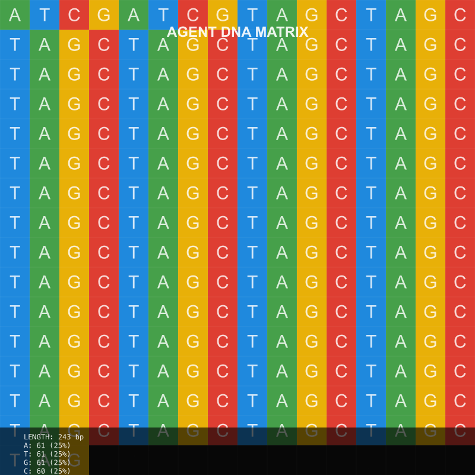

# DNA Generation & Analysis

## How Agent DNA is Generated

The Agent DNA system leverages advanced biological AI models to convert an agent's attributes, behaviors, and characteristics into a unique nucleotide sequence that follows principles inspired by biological DNA.

### Powered by Evo 2-40b

At the core of our DNA generation system is Evo 2, a state-of-the-art biological foundation model:

- **Massive Scale**: With 40 billion parameters, Evo 2 is the largest AI model for biology to date
- **Genomic Understanding**: Able to integrate information over long genomic sequences while retaining sensitivity to single-nucleotide changes
- **Universal Coverage**: Understands the genetic code for all domains of life
- **Extensive Training**: Trained on a dataset of nearly 9 trillion nucleotides

This powerful biological model enables our system to generate authentic DNA sequences that maintain biological plausibility while encoding agent-specific information.

### Generation Process

1. **Attribute Encoding**: 
   - Each agent attribute (name, adjectives, bio, etc.) is parsed and analyzed
   - Key characteristics are extracted and assigned weight based on importance
   - These properties are mapped to specific nucleotide patterns

2. **Sequence Construction**:
   - A base sequence is initialized with encoding of agent's core identity
   - Attribute-specific sections are appended in standardized sequence regions
   - Complementary binding patterns are maintained for structural integrity
   - Special marker sequences denote section boundaries

3. **Randomization & Uniqueness**:
   - Controlled entropy is introduced in non-critical regions
   - Agent creation timestamp influences certain sequence patterns
   - Statistical uniqueness verification ensures no collisions

4. **Cryptographic Hashing**:
   - The full sequence undergoes secure hashing for verification purposes
   - Short hash serves as a quick reference identifier
   - Hash becomes part of agent's immutable identity

### DNA Structure

The typical Agent DNA sequence consists of 200-500 nucleotides organized into functional regions:

| Region | Purpose | Example |
|--------|---------|---------|
| Header | Core identity information | ATCGTAGCATCGTAGC... |
| Traits | Personality and capabilities | GCTATAGCTAGC... |
| Behavior | Interaction patterns | CGCTATAGCTA... |
| Metadata | System and version info | TAGCATCGTAG... |
| Checksum | Integrity verification | ATCGATCGATCG |

## DNA Analysis

Once generated, Agent DNA sequences can be analyzed in numerous ways to derive insights and enable functionality.

### Sequence Analysis

The DNAService provides several analytical capabilities:

- **Nucleotide Distribution**: Analysis of A, T, G, C percentages and patterns
- **Region Extraction**: Isolation of specific functional sections of the DNA
- **Motif Identification**: Detection of recurring patterns with special significance
- **Entropy Assessment**: Measurement of randomness in specific regions
- **Similarity Comparison**: Measuring relatedness between two agent DNA sequences

### Compatibility Analysis

DNA sequences can be compared to determine agent compatibility for:

- **Collaboration Potential**: How effectively agents might work together
- **Knowledge Complementarity**: Areas where agents have reinforcing expertise
- **Interaction Patterns**: Predicting communication effectiveness
- **Skill Coverage**: Identifying collective capabilities and gaps

### Mutation & Evolution

The DNAService supports controlled mutation of DNA sequences to model agent evolution:

- **Point Mutations**: Single nucleotide changes reflecting minor adjustments
- **Insertions/Deletions**: Addition or removal of sequence segments for major changes
- **Region Swapping**: Exchange of functional areas between agents
- **Directed Evolution**: Guided changes to optimize for specific qualities

## Practical Applications

### Development Uses

- **Agent Versioning**: Track evolution through DNA sequence changes
- **Behavior Prediction**: Analyze DNA to anticipate agent responses
- **Automated Testing**: Generate test suites based on DNA characteristics
- **Performance Optimization**: Identify DNA patterns correlated with efficiency

### User-Facing Features

- **Agent Compatibility Matching**: Find agents that work well with existing ones
- **Trait Verification**: Confirm an agent has claimed capabilities
- **Collection Analysis**: Assess diversity and coverage in an agent portfolio
- **Origin Tracing**: Verify lineage and authenticity of agent derivatives

In the next section, we'll explore how these DNA sequences can be transformed into captivating visual representations through our DNA Visualization system.
