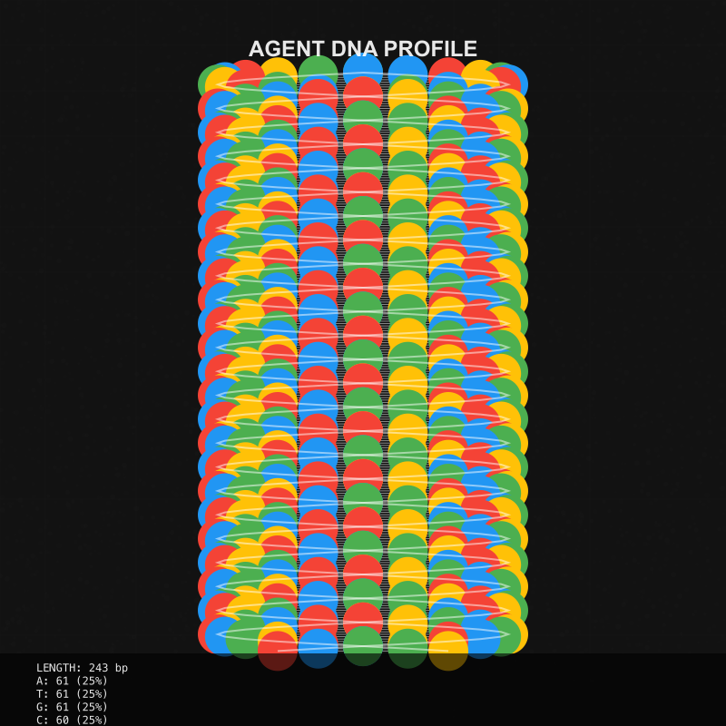

# Introduction to Agent DNA

## What is Agent DNA?

Agent DNA is a revolutionary feature in the Eliza framework that creates a unique biological-inspired digital signature for each AI agent. This DNA sequence serves as both a functional identifier and a visual representation of an agent's core characteristics.

Agent DNA transforms abstract AI agent traits into a tangible, analyzable sequence that can be:
- **Visualized** in multiple artistic representations
- **Analyzed** for compatibility with other agents
- **Used as a seed** for generating consistent agent behavior
- **Embedded in NFTs** to create truly unique digital assets

## Why Agent DNA Matters

### For Developers

- **Unique Identification**: Each agent's DNA provides a cryptographically secure identifier that can be used across systems
- **Behavior Seeding**: The DNA sequence can deterministically influence agent behavior patterns
- **Integration Points**: DNA serves as an anchor for attaching additional properties to agents
- **Cross-chain Compatibility**: DNA signatures work across different blockchain technologies

### For Users

- **Visual Recognition**: Easily identify your agents through their unique DNA visualization
- **Collectibility**: DNA patterns create naturally rare combinations that enhance NFT value
- **Transparency**: DNA sequences allow users to verify authenticity of agent origins
- **Enhanced Experience**: Visually appealing DNA representations improve the connection to agents

## Technical Foundation

Agent DNA is generated using advanced algorithms that convert agent attributes into nucleotide sequences similar to biological DNA. These sequences follow specific patterns:

1. **Base Encoding**: Agent properties are translated into sequences of A, T, G, and C nucleotides
2. **Structural Integrity**: Sequences maintain complementary binding properties like biological DNA
3. **Mutation Resistance**: Critical segments have error-correction to maintain identity
4. **Extensibility**: DNA can be extended with new properties while maintaining backward compatibility

## DNA in the Agent Lifecycle

Agent DNA is integrated throughout the agent lifecycle:

1. **Creation**: DNA is generated based on initial agent parameters
2. **Development**: DNA influences training and behavior patterns
3. **Visualization**: DNA is rendered into visual representations
4. **NFT Minting**: DNA is embedded in blockchain tokens
5. **Evolution**: DNA can undergo controlled mutations based on agent experiences

In the following sections, we'll explore how DNA is generated, analyzed, visualized, and integrated with NFTs to create a comprehensive biological-inspired framework for AI agents.
