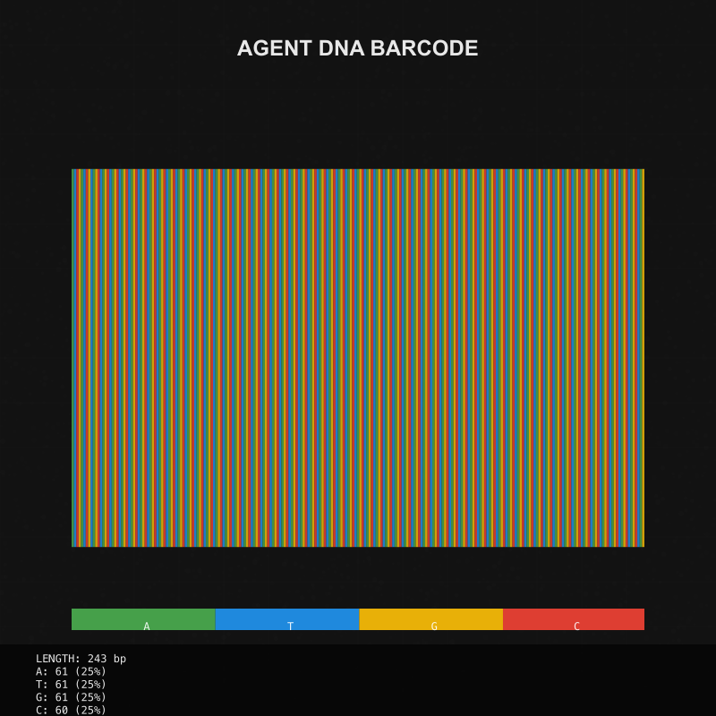

# Agent NFT Integration



## Merging DNA with NFTs

Agent DNA technology reaches its full potential when integrated with Non-Fungible Tokens (NFTs). This integration creates a new paradigm for AI agent ownership, authenticity verification, and value representation on blockchain networks.

## The Agent NFT Standard

Our Agent NFT standard combines the uniqueness of an agent's DNA with the benefits of blockchain technology:

### Key Components

1. **Core Metadata**:
   - Agent name, description, and essential properties
   - Versioning information and creation timestamps
   - Creator attribution and licensing information

2. **DNA Encoding**:
   - Complete DNA sequence embedded in token metadata
   - DNA hash for quick verification and reference
   - DNA visualization image as primary token display

3. **Functional Elements**:
   - Capability descriptors defining agent functionality
   - Integration endpoints for application connectivity
   - Behavioral parameters and constraints

4. **Visual Representation**:
   - DNA-derived visualization as primary NFT image
   - AI-generated agent avatar as secondary visual
   - Animation parameters for dynamic representations

## Cross-Chain Implementation

Agent NFTs can be deployed across multiple blockchain ecosystems, each with unique advantages:

### Solana Implementation

The Solana blockchain offers high performance and low transaction costs:

- **Token Program**: Metaplex Token Standard for NFT representation
- **Metadata Storage**: Arweave-based permanent storage for agent data
- **On-chain Verification**: DNA hash stored directly on-chain
- **Minting Process**: High-efficiency, low-cost creation process

### Ethereum Implementation

The Ethereum ecosystem provides broad compatibility and robust security:

- **Token Standard**: ERC-721 or ERC-1155 for NFT representation
- **Metadata Storage**: IPFS-based decentralized storage
- **Smart Contract Features**: Advanced ownership and licensing logic
- **Secondary Market Support**: Wide marketplace integration

### Bitcoin Implementation

Bitcoin Ordinals provide maximum security and longevity:

- **Inscription Method**: Full DNA embedded as Bitcoin inscription
- **Verification**: SHA-256 hash alignment with Bitcoin security model
- **Permanence**: Leveraging Bitcoin's proven long-term stability
- **Rare Satoshi Integration**: Special DNA sequences aligned with rare satoshis

## The NFT Creation Process

### Minting Workflow

1. **Agent Definition**:
   - Define agent properties, capabilities, and characteristics
   - Specify adjectives and personality traits
   - Create descriptive biography and purpose statement

2. **DNA Generation**:
   - Generate unique DNA sequence from agent properties
   - Compute cryptographic hash of the sequence
   - Validate uniqueness across the agent ecosystem

3. **Visualization Creation**:
   - Generate DNA visualization in selected style
   - Create avatar representation using AI image generation
   - Combine elements into final visual package

4. **Metadata Construction**:
   - Assemble complete token metadata including all elements
   - Add licensing and usage rights information
   - Include references to external resources and documentation

5. **Blockchain Transaction**:
   - Deploy metadata to decentralized storage
   - Execute blockchain transaction to mint NFT
   - Record transaction details and update registry

6. **Verification and Registration**:
   - Validate on-chain representation matches expected values
   - Register in agent directories and indexers
   - Publish to marketplaces if desired

## Use Cases and Applications

### Creator Economy

- **Agent Authorship**: Creators monetize their custom agents as NFTs
- **Royalty Streams**: Ongoing value capture from agent usage and transfers
- **Limited Editions**: Scarcity-based models for special agent releases
- **Collaborations**: Multi-creator agent development with shared royalties

### Enterprise Applications

- **Corporate Agents**: Officially verified company agents with secure identity
- **Team Attribution**: Recognition of development teams via NFT metadata
- **IP Protection**: Blockchain verification of proprietary agent authenticity
- **Licensing Models**: Enterprise licensing tracked via NFT ownership

### User Benefits

- **True Ownership**: Users genuinely own their agent instances
- **Portability**: Agent properties transferable across platforms via NFT
- **Investment Value**: Potential appreciation of valuable or rare agents
- **Community Status**: Collection and curation of premium agent portfolios

## Developer Implementation

### Integration Example

```typescript
// Example of minting an Agent NFT with embedded DNA
async function createAgentNFT(agent: AgentMetadata): Promise<AgentNFTResult> {
  // Generate DNA sequence
  const dnaService = new DNAService();
  const dnaResponse = await dnaService.generateDNA({
    startSequence: agent.name.substring(0, 10).toUpperCase(),
    numTokens: 256
  });
  
  // Create DNA visualization
  const visualizer = new DNAVisualizer();
  const visualizationPath = await visualizer.createVisualization(
    dnaResponse.sequence,
    '',
    { style: 'circular' }
  );
  
  // Generate avatar using AI
  const imageService = new ImageGenerationService();
  const avatarPath = await imageService.generateAgentAvatar(agent, dnaResponse);
  
  // Mint NFT with DNA data
  const nftService = new NFTService();
  const result = await nftService.mintNFT(
    {
      name: agent.name,
      description: agent.description,
      symbol: 'AGENT',
      agentDNA: dnaResponse.sequence,
      attributes: [
        { trait_type: 'DNA Hash', value: dnaResponse.hash.substring(0, 8) },
        ...agent.attributes
      ],
      dnaVisualizationUrl: visualizationPath
    },
    avatarPath
  );
  
  return {
    agent,
    dna: dnaResponse,
    nftAddress: result.mintAddress,
    imageUrl: result.imageUrl,
    metadataUrl: result.metadataUri,
    explorerUrl: result.explorerUrl
  };
}
```

## Future Roadmap

The Agent NFT system continues to advance with several exciting developments:

- **Decentralized Agent Hosting**: Run agents directly from NFT metadata
- **Evolutionary Models**: Agents that evolve based on usage, reflected in NFT
- **Composability**: Combining agent NFTs to create new composite agents
- **Cross-platform Standards**: Universal integration across AI ecosystems
- **Governance Models**: Community governance of agent standards and registries

By bringing together the unique properties of Agent DNA and blockchain technology, we've created a new paradigm for AI agent representation, ownership, and value. This integration opens up countless possibilities for creators, developers, and users in the growing agent economy.
