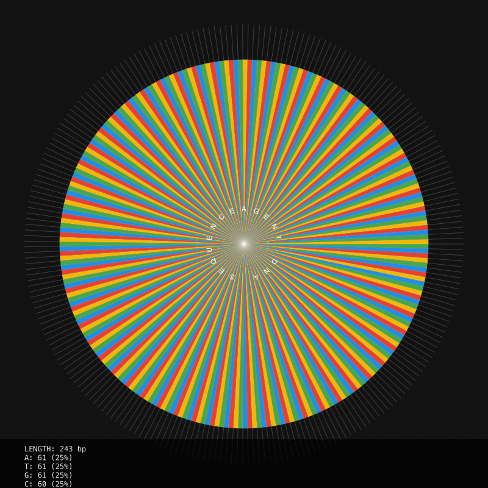

# DNA Visualization



## The Art of DNA Visualization

Agent DNA visualization transforms abstract nucleotide sequences into striking visual representations that convey both information and aesthetic appeal. This capability sits at the intersection of science, data visualization, and digital art.

## Visualization Styles

The DNAVisualizer module supports multiple visualization styles, each offering a unique perspective on the agent's DNA.

### Helix Style

The classic double helix representation provides a biologically-inspired visualization that's immediately recognizable:

- Twin spiraling strands with nucleotide pairs
- Color-coded bases (A, T, G, C) with complementary binding
- Subtle environmental details that give depth and context
- Metadata and statistics displayed along the bottom

This style is ideal for conveying the biological inspiration of the Agent DNA system and works well in detailed presentations.

### Grid Style

The grid representation offers a compact, data-dense visualization:

- Matrix layout with each cell representing a nucleotide
- Color-coded cells based on base type
- Letter overlays showing the exact nucleotide
- Clean, structured format suitable for technical contexts

This style excels at showing patterns across the entire sequence at once and works well in technical documentation.

### Circular Style

The circular (radial) representation creates a mandala-like pattern:

- Nucleotides arranged in a circle radiating from the center
- Segment length varies based on probability or significance
- Color-coded by nucleotide type with opacity variation
- Central circular text reinforces the agent identity

This style creates the most visually striking images and is excellent for profile avatars and NFT visual representations.

### Barcode Style

The barcode representation offers a condensed linear view:

- Vertical bars of varying height represent each nucleotide
- Color-coded by nucleotide type
- Compact format ideal for comparing multiple sequences
- Nucleotide distribution statistics shown as percentage bars

This style works well for thumbnails and comparison views where multiple DNA sequences need to be shown together.

## Technical Implementation

### Canvas Rendering

The DNAVisualizer uses modern canvas rendering techniques to create high-quality visualizations:

```typescript
// Example of basic visualization initialization
const visualizer = new DNAVisualizer();
const outputPath = await visualizer.createVisualization(
  dnaSequence,           // The DNA sequence to visualize
  './output/dna.png',    // Output file path
  {
    style: 'helix',      // Visualization style
    width: 1024,         // Image width in pixels
    height: 1024,        // Image height in pixels
    backgroundColor: '#121212', // Background color
    seed: 12345          // Optional seed for deterministic rendering
  }
);
```

### Customization Options

The visualization system offers extensive customization:

- **Dimensions**: Control output size for different use cases
- **Color Schemes**: Modify colors for different visual themes 
- **Seed Values**: Generate consistent visualizations using deterministic seeds
- **Background Effects**: Adjust textures, grid lines, and ambient elements
- **Metadata Display**: Control what statistics and information appear

### Integration with Agent Pipeline

DNA visualization is typically integrated at several points in the agent lifecycle:

1. **Development**: Generated during agent creation and shown in developer tools
2. **Presentation**: Used in agent profiles, directories, and documentation
3. **NFT Creation**: Embedded in NFT metadata for collection displays
4. **Analysis**: Created on-demand during DNA comparison operations

## Use Cases

### Developer Experience

- **Agent Identity**: Visual representations for agent directories
- **Debugging**: Visual cues for identifying sequence peculiarities 
- **Documentation**: Rich illustrations for agent capabilities
- **Version Comparison**: Visual diffs between agent iterations

### User Experience

- **Agent Selection**: Visual differentiation between available agents
- **Collection Management**: Visually compelling NFT galleries
- **Personalization**: User-selected visualization styles for their agents
- **Social Sharing**: Distinctive images for sharing agent collections

### NFT Enhancement

- **Visual Appeal**: Eye-catching representations increase collector interest
- **Rarity Signaling**: Visual patterns can subtly indicate rare traits
- **Collection Coherence**: Shared visual language across a collection
- **Authentication**: Visual verification of authentic agent DNA

## Future Directions

The visualization system continues to evolve with planned enhancements:

- **Interactive Visualizations**: Web-based interactive DNA explorers
- **Animated Representations**: Motion-based DNA visualizations showing mutation and evolution
- **3D Renderings**: Three-dimensional DNA models for immersive experiences
- **AR Integration**: Augmented reality displays of agent DNA
- **Style Transfer**: AI-enhanced rendering using agent personality to influence artistic style

In the next section, we'll explore how Agent DNA integrates with NFT systems to create unique digital assets with functional and aesthetic value.
