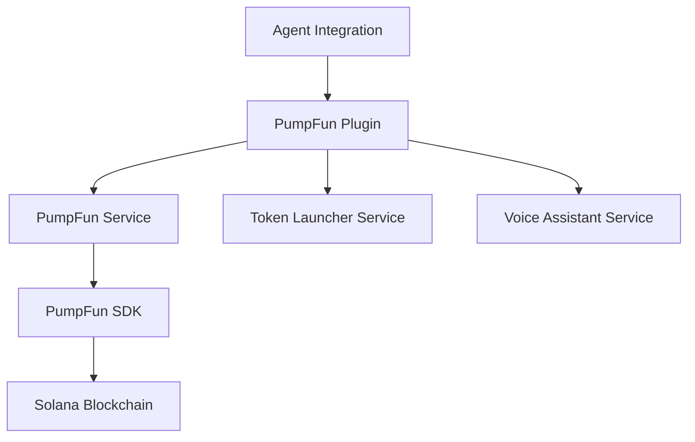

# PumpFun Plugin

The PumpFun Plugin is a comprehensive integration with the [pump.fun](https://pump.fun) platform, allowing you to interact with Solana memecoin creation and trading directly from your Eliza-powered agent.

## Overview

Pump.fun is a popular platform for creating and trading memecoins on the Solana blockchain. The PumpFun Plugin provides a complete set of tools to:

- Launch new tokens with customizable metadata and images
- Buy tokens using SOL
- Sell tokens according to specified percentage
- Track token balances and market performance
- Manage token assets through an agent interface

## Key Features

- **Token Creation**: Generate new SPL tokens with customized metadata, including name, symbol, description, and social links
- **Token Trading**: Buy and sell SPL tokens directly through the pump.fun platform
- **Wallet Integration**: Connect with Solana wallets to manage token transactions
- **Agent Integration**: Command-line interface for AI agents to create and manage tokens
- **Voice Assistant**: Natural language interface for token management

## Architecture

The PumpFun Plugin is designed with a modular architecture:

- **Agent Integration**: Primary interface for Eliza agents
- **PumpFun Plugin**: Core implementation providing access to all features
- **PumpFun Service**: Low-level service handling direct interactions with the PumpFun platform
- **Token Launcher Service**: Specialized service for token creation and management
- **Voice Assistant Service**: Natural language processing for token commands

## Getting Started

- [Installation and Setup](./installation.md)
- [Basic Usage](./basic-usage.md)
- [API Reference](./api-reference.md)
- [Agent Integration](./agent-integration.md)
- [Examples](./examples.md)
- [Advanced Configuration](./advanced-configuration.md)
